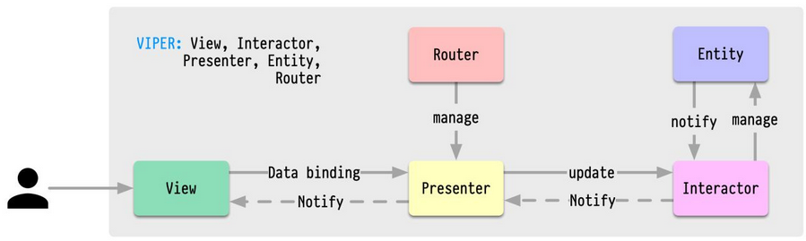

# abalone

## MVP

- [x] board
- [x] select piece
- [ ] show legal moves
- [ ] move pieces
- [ ] multi-move
- [ ] legal moves only

## Architecture

We could use a Model-View-Update architecture.

```
             -----> View -------
            |                   |
            |                   V
User ---> Model <------------ Update
```

But we also want to isolate routing logic, so we need a big more sophistication.



- **View**: Displays information from the Presenter and sends user interactions back to the Presenter.
- **Interactor**: Retrieves Entities and contains the business logic for a particular use case. They are view agnostic and can be consumed by one or many Presenters.
- **Presenter**: Handles preparing content for the display and intercepting user interactions.
- **Entity**: Simple data model objects.
- **Router**: Handles navigation logic for which screens should appear and when.

Resources: https://medium.com/slalom-build/clean-architecture-for-ios-development-using-the-viper-pattern-fac30f5d29fc
